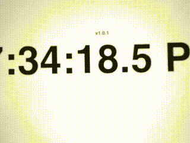
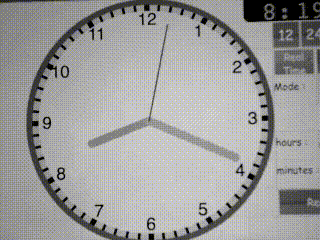

# README

This repository contains my ECEN-5623 final project, an embedded linux real-time synchronome.  This program can be used to take 1801 unique images of an analog clock at 1Hz or 1801 unique images of a digital clock representing each 1/10th of a second at 10Hz.  Please read my report to understand the general architecture and analysis of this project.

Below is a gif of the 10 Hz requirement frames captured being played back at half speed:

Below is a gif of the 1 Hz requirement frames captured being played back at 5x speed:

